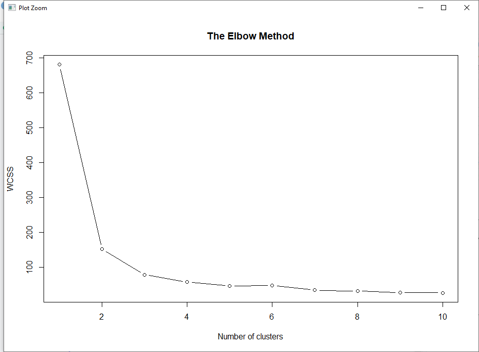

<div align="center">

</p>

**Technological Institute of Tijuana** 

**Academic Subdirectorate** 

**Systems and Computing Department** 

**SEMESTER:** 
August - December 2021

**CAREER:** 
Computer Systems Engineer

**MATTER:** 
Data Mining

**JOB NAME:** 
Unit 4 - Exam

**STUDENT NAME AND CONTROL NUMBER:** 


Castro Cebreros Alejandro - 16211341 

Márquez Millán Seashell Vanessa - 17212153

**TEACHER NAME:** 
Jose Christian Romero Hernandez

**DATE OF DELIVERY:** 
Dicember 12, 2021

</div>

<div align="Justify">

### Developement 


The firs part is decide where we want work and we put the direction
```R
getwd()
setwd("C:/Users/vanem/OneDrive/Documentos/9 SEMESTRE/Mineria/Repo mineria/DataMining/MachineLearning/LogisticRegression")
getwd()
```
<br>

Now we import the data set and select the columns

```R
dataset <- read.csv(file.choose())
dataset = dataset[1:4]
```
<br>

Well here we used the the elbow method to find the optimal number of cluster, but these method is on the funcion because is more easy to visualizing the graphic, and after we call the function and send like param the data set and the resul is here.
```R
TEM <- function(dataset){
        set.seed(6)
        wcss = vector()
        for (i in 1:10) wcss[i] = sum(kmeans(dataset, i)$withinss)
        plot(1:10,
             wcss,
             type = 'b',
             main = paste('The Elbow Method'),
             xlab = 'Number of clusters',
             ylab = 'WCSS')
}

TEM(dataset)
```


Like we can see the breaking point is in the point number 3 so is these the number we used more later.

<br>

Here we used the model and fitting the dataset 
```R
set.seed(29)
kmeans = kmeans(x = dataset, centers = 3)
y_kmeans = kmeans$cluster
```