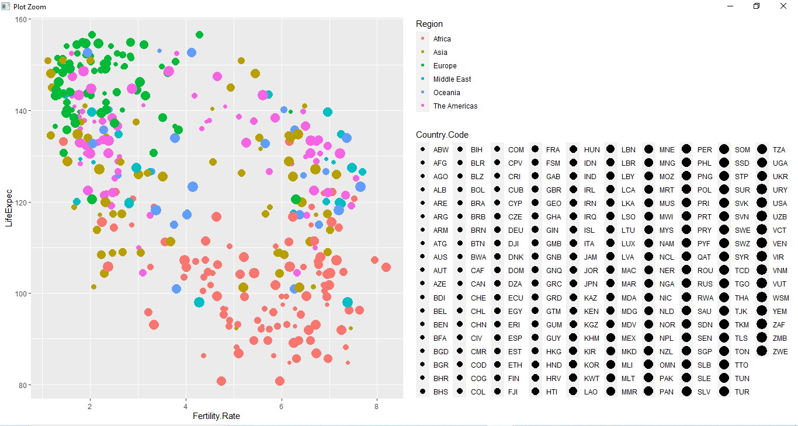

    

<H2>
TECNOLÓGICO NACIONAL DE MÉXICO
</H2>

<H2>
INSTITUTO TECNOLÓGICO DE TIJUANA
</H2>

<H2>
SUBDIRECCIÓN ACADÉMICA
</H2>

<H2>
DEPARTAMENTO DE SISTEMAS Y COMPUTACIÓN
</H2>

<H2>
NOMBRE DE LOS ALUMNOS: 
</H2>

<H2>
CASTRO CEBREROS ALEJANDRO
</H2>

<H2>
MARQUEZ MILLAN SEASHELL VANESSA
</H2>

<H2>
Carrera: Ingeniería Informática
</H2>

<H2>
Semestre: 9no 
</H2>

<H2>
MATERIA: Mineria de datos
</H2>

<H2>
PROFESOR: JOSE CHRISTIAN ROMERO HERNANDEZ
</H2>

<H2>
Practica evaluatoria 1
</H2>

<H2>
Unidad 1
</H2>

 
 
 
 
 
 
 
 
---

# DESARROLLO  
## Abstrac

In that practice we use the program R studios and create a diferents graphics with the comands used in class too we did the analitics of the data frames, we use differntes funccions for connect the schemma and to do opperations 

  

**Generate scatter-plot** 
The first thing is select the dataframe, for that we need to create a variable where save that df, and chose the correct file then create the vectors needs with that we put together the df and the vectors, but before we revise if the count of each vector it was the correct, and we did only one vector for after put with the principal df, the last thing was the import the library and made the graphic.
 

    

   

**Create graphic for each year** 
Well in this case first we made a filter using the df with the vectors and select the year we want then only we made the graphic

    

    

**Comparison of the two periods**

With the information shown in the graphs, we can see a great change in the fertility rate that has dropped considerably in 2013 than in 1960. Among the changes, it can be seen that the African region continues to have the highest fertility rate even after 53 years, which, compared to European countries, continue with a low rate. The region that saw the most changes was Asia than in 1960 most of their countries had a rate of 4 onwards and then in 2013 their rate is less than 4. In the other regions, a change in their fertility rate could be seen, but not as drastic as the regions mentioned above. There are many reasons for the change in fertility of each country these can be personal, economic, social or political, a serious example in the Asian region in China that had its policy of only having one child per couple to better control overpopulation in the country, this law was established in 1979, seeing this we can see its results with the 2013 graph.

