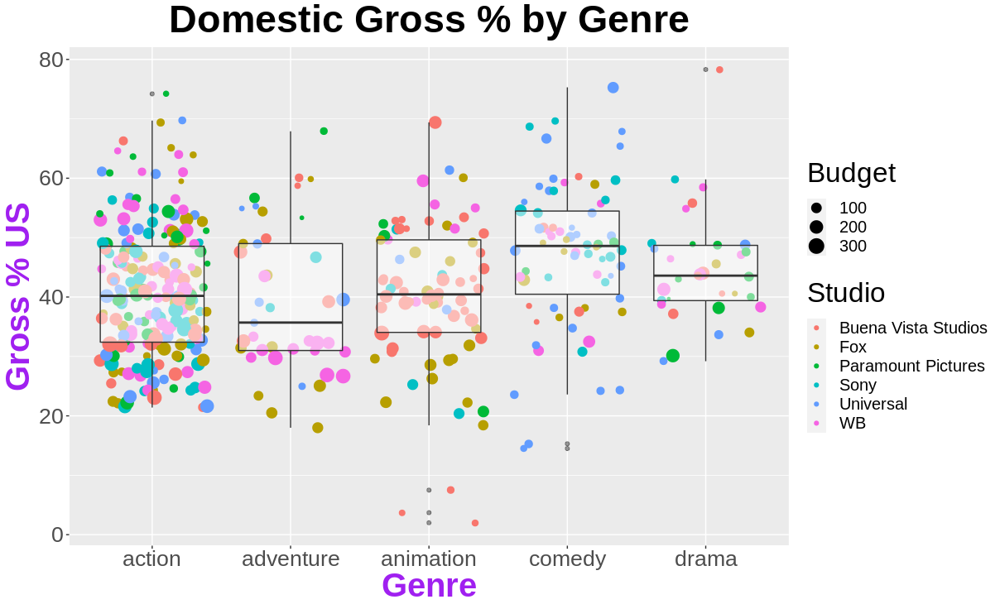

<div align="center">

</p>

**Technological Institute of Tijuana** 

**Academic Subdirectorate** 

**Systems and Computing Department** 

**SEMESTER:** 
August - December 2021

**CAREER:** 
Computer Systems Engineer

**MATTER:** 
Data Mining

**JOB NAME:** 
Unit 2 - Evaluation

**STUDENT NAME AND CONTROL NUMBER:** 


Castro Cebreros Alejandro - 16211341 

Márquez Millán Seashell Vanessa - 17212153

**TEACHER NAME:** 
Jose Christian Romero Hernandez

**DATE OF DELIVERY:** 
November 10, 2021

</div>

##First we select the csv file that we will use
```R 
Movies <- read.csv(file.choose())
```

##Rename the columns 
```R
colnames(Movies) <- c("Dayofweek", "Director", "Genre", "MovieTitle", "RealseDate", "Studio", "AdjustedGroosMill","Budget", "GrossMill","IMDbRating", "MovieLensRating", "OverseasMill","Overseas", "ProfitMill", "Profit", "RuntimeMin", "UsMill", "GrossUS")
```

##We wont use all the genres so we will filter it to select specific ones
```R
dfgenre <- Movies$Genre %in% c("action","adventure","animation","comedy","drama")

filtermovies <- Movies[dfgenre,]
```

##Same as genre, we use the same method with the studios
```R
dfstudio <- filtermovies$Studio %in% c("Buena Vista Studios","Fox","Paramount Pictures","Sony","Universal","WB")
```

##We make a new dataframe with the other fitered dataframe
```R
Finalmovies <- filtermovies[dfstudio,]
```

##We use libraries extrafont for selecting a custom font and ggplot for the graph
```R
library(extrafont)
library(ggplot2)
```

##Import and load fonts 
```R
font_import()
loadfonts()
```

##We create the structure of the graph
```R
u <- ggplot(Finalmovies, aes(x = Genre, y = GrossUS))
t <- u + geom_jitter(aes(color = Studio, size = Budget)) + geom_boxplot (alpha = 0.5) 

t + 
  xlab("Genre") +
  ylab("Gross % US") +
  ggtitle("Domestic Gross % by Genre") +
  theme(axis.title.x = element_text(color = "Purple", size=30,  face = "bold"),
        axis.title.y = element_text(color = "Purple", size=30,  face = "bold"),
        axis.text.x = element_text(size = 20),
        axis.text.y = element_text(size = 20),
        legend.title = element_text(size = 25),
        legend.text = element_text(size = 15),
        legend.justification = c(1,.5),
        text = element_text( family = "Arial"),
        plot.title = element_text(color = "Black",
                                  size = 35,
                                  hjust = 0.5,
                                  face = "bold"))
```

##The graph that we end up

<p align="center">
    
</p>
