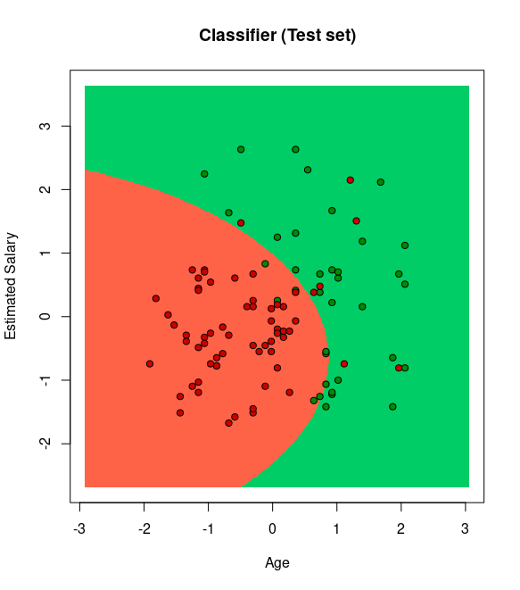

<div align="center">

</p>

**Technological Institute of Tijuana** 

**Academic Subdirectorate** 

**Systems and Computing Department** 

**SEMESTER:** 
August - December 2021

**CAREER:** 
Computer Systems Engineer

**MATTER:** 
Data Mining

**JOB NAME:** 
Unit 3 - Evaluation

**STUDENT NAME AND CONTROL NUMBER:** 


Castro Cebreros Alejandro - 16211341 

Márquez Millán Seashell Vanessa - 17212153

**TEACHER NAME:** 
Jose Christian Romero Hernandez

**DATE OF DELIVERY:** 
December 8, 2021

</div>

<div align="Justify">

**WHERE WE GO TO WORK**

```R 
getwd()
setwd("C:/Users/vanem/OneDrive/Documentos/9 SEMESTRE/Mineria/Repo mineria/DataMining/MachineLearning/LogisticRegression")
getwd()
```

**CALL THE LIBRARY**

```R 
library(e1071)     
library(naivebayes) 
library(ElemStatLearn)
library(caTools)
library(ggplot2)
``` 

**IMPORTING THE DF**

```R 
dataset <- read.csv(file.choose())
dataset = dataset[3:5]
```

**ENCODING THE TARGET FEATURES AS FACTOR**

```R 
dataset$Purchased=factor(dataset$Purchased,levels = c(0,1))
```

**SPLIT THE DF INTO THE TRAINIG SET AND TEST SET**

```R 
set.seed(123)
split=sample.split(dataset$Purchased, SplitRatio = 0.75)
training_set=subset(dataset,split==TRUE)
test_set=subset(dataset,split==FALSE)
```

**FEATURE SCALING**

```R 
training_set[-3]=scale(training_set[-3])
test_set[-3]=scale(test_set[-3])
```

**FITTING NAIVE BAYES TO THE TRAINING SET**

```R 
classifier=naive_bayes(formula=Purchased ~ . , 
                       data=training_set,
                       type='C-classification',
                       kernel='linear')
```

**PREDICTING TEST RESULT**

```
y_pred=predict(classifier,newdata=test_set[-3])
y_pred
```

**CONFUSION MATRIX**

```R 
cm=table(test_set[, 3],y_pred)
cm
```

**VISUALITATION**

**TRAINING SET**

```R 
set = training_set
X1 = seq(min(set[, 1]) - 1, max(set[, 1]) + 1, by = 0.01)
X2 = seq(min(set[, 2]) - 1, max(set[, 2]) + 1, by = 0.01)
grid_set = expand.grid(X1, X2)
colnames(grid_set) = c('Age', 'EstimatedSalary')
y_grid = predict(classifier, newdata = grid_set)
plot(set[, -3],
     main = 'Classifier (Training set)',
     xlab = 'Age', ylab = 'Estimated Salary',
     xlim = range(X1), ylim = range(X2))
contour(X1, X2, matrix(as.numeric(y_grid), length(X1), length(X2)), add = TRUE)
points(grid_set, pch = '.', col = ifelse(y_grid == 1, 'springgreen3', 'tomato'))
points(set, pch = 21, bg = ifelse(set[, 3] == 1, 'green4', 'red3'))
```

<p >
  
</p>


**TEST SET**

```R 
set = test_set
X1 = seq(min(set[, 1]) - 1, max(set[, 1]) + 1, by = 0.01)
X2 = seq(min(set[, 2]) - 1, max(set[, 2]) + 1, by = 0.01)
grid_set = expand.grid(X1, X2)
colnames(grid_set) = c('Age', 'EstimatedSalary')
y_grid = predict(classifier, newdata = grid_set)
plot(set[, -3], main = 'Classifier (Test set)',
     xlab = 'Age', ylab = 'Estimated Salary',
     xlim = range(X1), ylim = range(X2))
contour(X1, X2, matrix(as.numeric(y_grid), length(X1), length(X2)), add = TRUE)
points(grid_set, pch = '.', col = ifelse(y_grid == 1, 'springgreen3', 'tomato'))
points(set, pch = 21, bg = ifelse(set[, 3] == 1, 'green4', 'red3'))
```

<p >
  
</p>