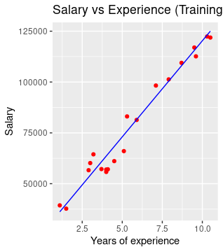
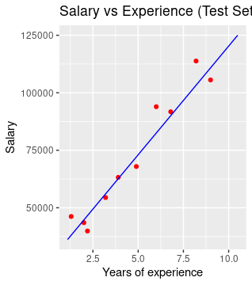

<div align="center">

</p>

**Technological Institute of Tijuana** 

**Academic Subdirectorate** 

**Systems and Computing Department** 

**SEMESTER:** 
August - December 2021

**CAREER:** 
Computer Systems Engineer

**MATTER:** 
Data Mining

**JOB NAME:** 
Unit 3 - Practice 1

**STUDENT NAME AND CONTROL NUMBER:** 


Castro Cebreros Alejandro - 16211341 

Márquez Millán Seashell Vanessa - 17212153

**TEACHER NAME:** 
Jose Christian Romero Hernandez

**DATE OF DELIVERY:** 
November 26, 2021

</div>

<div align="Justify">

**Assign the directory of the file**

```R 
getwd()
setwd("/home/chris/Documents/itt/Enero_Junio_2020/Mineria_de_datos/DataMining/MachineLearning/SimpleLinearRegression")
getwd()
```

**Importing the dataset**

```R 
dataset <- read.csv(file.choose())
```

**Splitting the dataset into the Training set and Test set**

```R 
Install.packages('caTools') 

library(caTools)
set.seed(123)
split <- sample.split(dataset$Salary, SplitRatio = 2/3)
training_set <- subset(dataset, split == TRUE)
test_set <- subset(dataset, split == FALSE)
```

**Fitting Simple Linear Regression to the Training set**

```R 
regressor = lm(formula = Salary ~ YearsExperience,
               data = dataset)
summary(regressor)
```

**Predicting the Test set results**

```R 
y_pred = predict(regressor, newdata = test_set)
```

**Visualising the Training set results**

```R 
library(ggplot2)
ggplot() +
  geom_point(aes(x=training_set$YearsExperience, y=training_set$Salary),
             color = 'red') +
  geom_line(aes(x = training_set$YearsExperience, y = predict(regressor, newdata = training_set)),
            color = 'blue') +
  ggtitle('Salary vs Experience (Training Set)') +
  xlab('Years of experience') +
  ylab('Salary')
```

**Here we have the training set graph that show's us the relation two variables that in this case is Salary representing "y" and Years of experience being the "x". Using lineal regression we can predict the value of the next variable, we see that the early years and late years have more relation between the two  variables.**
<p >
  
</p>


# Visualising the Test set results

```R 
ggplot() +
  geom_point(aes(x=test_set$YearsExperience, y=test_set$Salary),
             color = 'red') +
  geom_line(aes(x = training_set$YearsExperience, y = predict(regressor, newdata = training_set)),
            color = 'blue') +
  ggtitle('Salary vs Experience (Test Set)') +
  xlab('Years of experience') +
  ylab('Salary')
```

**For test, we can see a very noticeable aspect in the graph, the fact that it was less values represented in the graph, it's because of subset that returns subsets of data that can be vectors or dataframes that aproved the established conditions that with test set is with the split == False **
<p >
  
</p>


