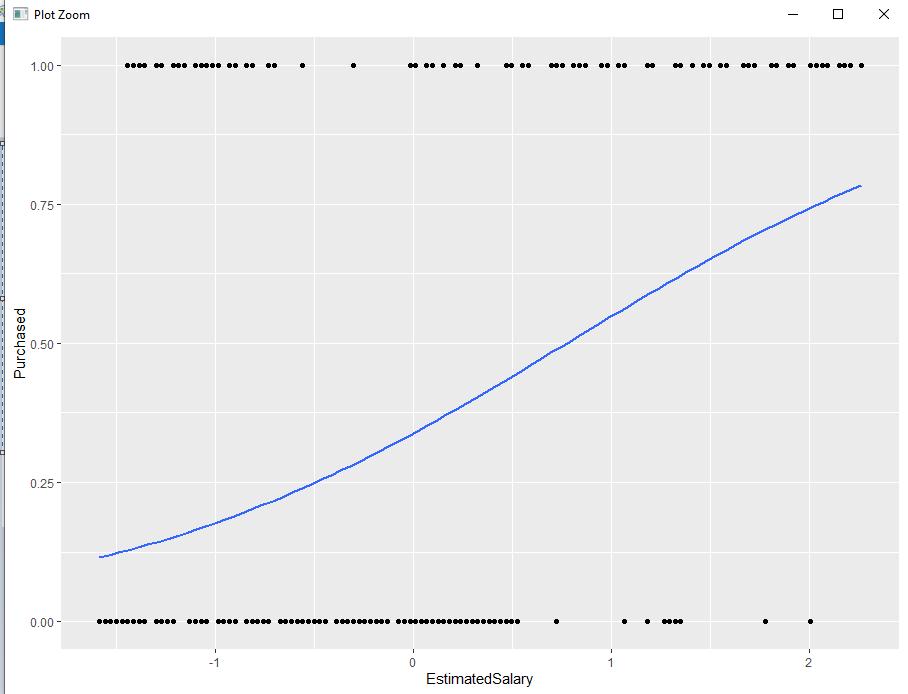
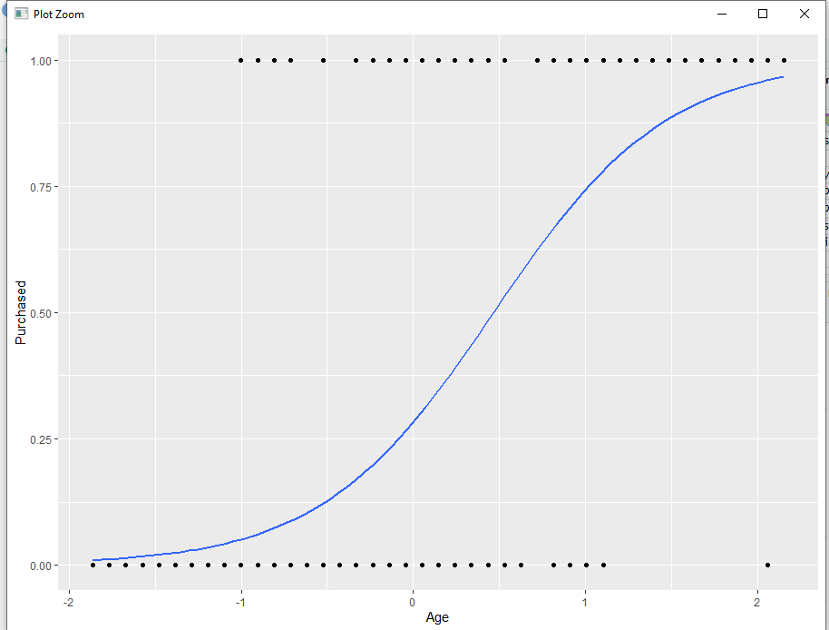
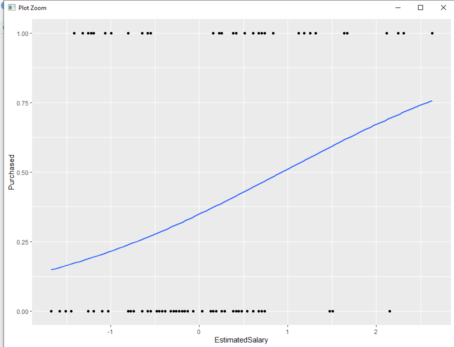
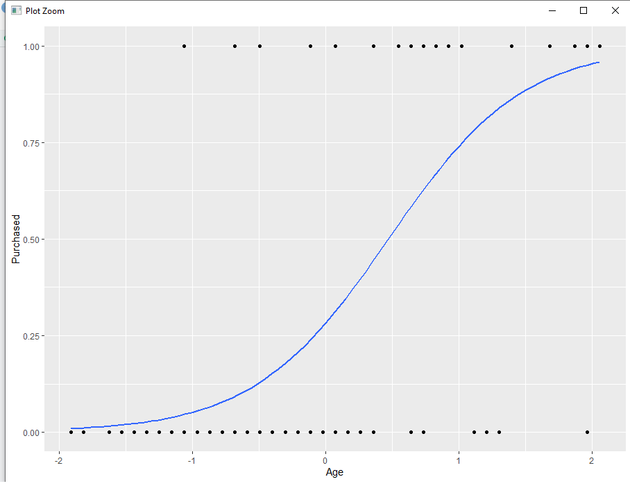
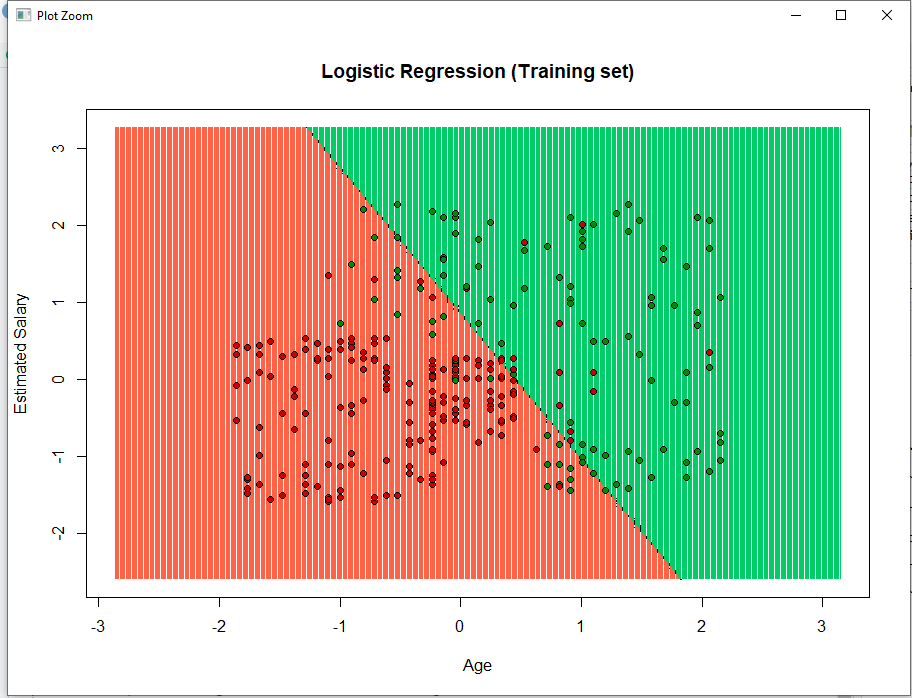

<div align="center">

</p>

**Technological Institute of Tijuana** 

**Academic Subdirectorate** 

**Systems and Computing Department** 

**SEMESTER:** 
August - December 2021

**CAREER:** 
Computer Systems Engineer

**MATTER:** 
Data Mining

**JOB NAME:** 
Unit 3 - Practice 3

**STUDENT NAME AND CONTROL NUMBER:** 


Castro Cebreros Alejandro - 16211341 

Márquez Millán Seashell Vanessa - 17212153

**TEACHER NAME:** 
Jose Christian Romero Hernandez

**DATE OF DELIVERY:** 
November 29, 2021

<br>
<br>
<br>
<br>
<br>
<br>
<br>
<br>

<div align="Justify">

## Development

The first steps there are so commune, because we need to use on the majority of the DF

Chose on were directory we go to work

```R
getwd()
setwd("C:/Users/vanem/OneDrive/Documentos/9 SEMESTRE/Mineria/Repo mineria/DataMining/MachineLearning/LogisticRegression")
getwd()
```
Decide which DataSet we go to use, and chose the colums we need 

```R
dataset <- read.csv('Social_Network_Ads.csv')
dataset <- dataset[, 3:5]
```

For create the number pseudo random need declarate a seed, after decide in how much split, and we train to dataset

```R
library(caTools)
set.seed(123)
split <- sample.split(dataset$Purchased, SplitRatio = 0.75)
training_set <- subset(dataset, split == TRUE)
test_set <- subset(dataset, split == FALSE)

```
Now we do the feature scaling

```R
training_set[, 1:2] <- scale(training_set[, 1:2])
test_set[, 1:2] <- scale(test_set[, 1:2])
```

Here we do the fitting Logistic Regression to Training set

```R
classifier = glm(formula = Purchased ~ .,
                 family = binomial,
                 data = training_set)
```

So now we need to do the prediction test set results, the result of this code is a data collection of the predictions

```R
prob_pred = predict(classifier, type = 'response', newdata = test_set[-3])
prob_pred
y_pred = ifelse(prob_pred > 0.5, 1, 0)
y_pred
```

Whe the result of the prediction we go to do the confuccion matrix, is here were we can see the perfomance to algoritm

```R
cm = table(test_set[, 3], y_pred)
cm
```

Here is the visualization to different things, this is when the training set and the relation when salary, the secon is with age.

```R
ggplot(training_set, aes(x=EstimatedSalary, y=Purchased)) + geom_point() + 
  stat_smooth(method="glm", method.args=list(family="binomial"), se=FALSE)

```


```R
ggplot(training_set, aes(x=Age, y=Purchased)) + geom_point() + 
  stat_smooth(method="glm", method.args=list(family="binomial"), se=FALSE)
```


Here take the test set and the first is about salary and the second with the age

```R
ggplot(test_set, aes(x=EstimatedSalary, y=Purchased)) + geom_point() + 
  stat_smooth(method="glm", method.args=list(family="binomial"), se=FALSE)
```


```R
ggplot(test_set, aes(x=Age, y=Purchased)) + geom_point() + 
  stat_smooth(method="glm", method.args=list(family="binomial"), se=FALSE)
  ```


  And here we can see the result, the data sample is more likely you can bouy a car if you are more old but obvius there may be exceptions or wrongs 

  ```R
  library(ElemStatLearn)
set = training_set
X1 = seq(min(set[, 1]) - 1, max(set[, 1]) + 1, by = 0.01)
X2 = seq(min(set[, 2]) - 1, max(set[, 2]) + 1, by = 0.01)
grid_set = expand.grid(X1, X2)
colnames(grid_set) = c('Age', 'EstimatedSalary')
prob_set = predict(classifier, type = 'response', newdata = grid_set)
y_grid = ifelse(prob_set > 0.5, 1, 0)
plot(set[, -3],
     main = 'Logistic Regression (Training set)',
     xlab = 'Age', ylab = 'Estimated Salary',
     xlim = range(X1), ylim = range(X2))
contour(X1, X2, matrix(as.numeric(y_grid), length(X1), length(X2)), add = TRUE)
points(grid_set, pch = '.', col = ifelse(y_grid == 1, 'springgreen3', 'tomato'))
points(set, pch = 21, bg = ifelse(set[, 3] == 1, 'green4', 'red3'))
  ```
  

</di>