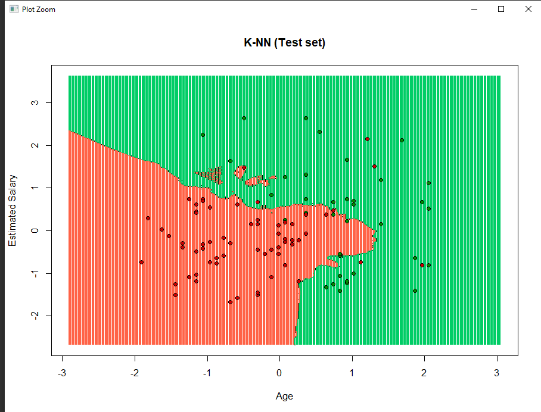

<div align="center">

</p>

**Technological Institute of Tijuana** 

**Academic Subdirectorate** 

**Systems and Computing Department** 

**SEMESTER:** 
August - December 2021

**CAREER:** 
Computer Systems Engineer

**MATTER:** 
Data Mining

**JOB NAME:** 
Unit 3 - Practice 4

**STUDENT NAME AND CONTROL NUMBER:** 


Castro Cebreros Alejandro - 16211341 

Márquez Millán Seashell Vanessa - 17212153

**TEACHER NAME:** 
Jose Christian Romero Hernandez

**DATE OF DELIVERY:** 
November 29, 2021

<br>
<br>
<br>
<br>
<br>
<br>
<br>
<br>

<div align="Justify">

## Development

The first steps there are so commune, because we need to use on the majority of the DF

Chose on were directory we go to work

```R
getwd()
setwd("C:/Users/vanem/OneDrive/Documentos/9 SEMESTRE/Mineria/Repo mineria/DataMining/MachineLearning/LogisticRegression")
getwd()
```
Decide which DataSet we go to use, and chose the colums we need 

```R
dataset = read.csv('Social_Network_Ads.csv')
dataset = dataset[3:5]
```

For create the number pseudo random need declarate a seed, after decide in how much split, and we train to dataset

```R
library(caTools)
set.seed(123)
split = sample.split(dataset$Purchased,
dataset$Purchased = factor(dataset$Purchased, levels = c(0, 1))
```
Now we do the feature scaling

```R
 SplitRatio = 0.75)
training_set = subset(dataset, split == TRUE)
test_set = subset(dataset, split == FALSE)
```

So now we need to do the prediction test set results, the result of this code is a data collection of the predictions

```R
library(class)
y_pred = knn(train = training_set[, -3],
             test = test_set[, -3],
             cl = training_set[, 3],
             k = 5,
             prob = TRUE)
```

Whe the result of the prediction we go to do the confuccion matrix, is here were we can see the perfomance to algoritm

```R
cm = table(test_set[, 3], y_pred)
cm
```

The last part is see the result to aplicate the algoritm KNN basically separate the data on groups and we can se the most important, but here see the data about the training set

```R
library(ElemStatLearn)
set = training_set
X1 = seq(min(set[, 1]) - 1, max(set[, 1]) + 1, by = 0.01)
X2 = seq(min(set[, 2]) - 1, max(set[, 2]) + 1, by = 0.01)
grid_set = expand.grid(X1, X2)
colnames(grid_set) = c('Age', 'EstimatedSalary')
y_grid = knn(train = training_set[, -3], test = grid_set, cl = training_set[, 3], k = 5)
plot(set[, -3],
     main = 'K-NN (Training set)',
     xlab = 'Age', ylab = 'Estimated Salary',
     xlim = range(X1), ylim = range(X2))
contour(X1, X2, matrix(as.numeric(y_grid), length(X1), length(X2)), add = TRUE)
points(grid_set, pch = '.', col = ifelse(y_grid == 1, 'springgreen3', 'tomato'))
points(set, pch = 21, bg = ifelse(set[, 3] == 1, 'green4', 'red3'))
```


And here we can see the equals data but with the test set, and we can see a big diference with the results, well the result is equals because the column age is more important but, the data is so diferent, because there are too less points

```R
library(ElemStatLearn)
set = test_set
X1 = seq(min(set[, 1]) - 1, max(set[, 1]) + 1, by = 0.01)
X2 = seq(min(set[, 2]) - 1, max(set[, 2]) + 1, by = 0.01)
grid_set = expand.grid(X1, X2)
colnames(grid_set) = c('Age', 'EstimatedSalary')
y_grid = knn(train = training_set[, -3], test = grid_set, cl = training_set[, 3], k = 5)
plot(set[, -3],
     main = 'K-NN (Test set)',
     xlab = 'Age', ylab = 'Estimated Salary',
     xlim = range(X1), ylim = range(X2))
contour(X1, X2, matrix(as.numeric(y_grid), length(X1), length(X2)), add = TRUE)
points(grid_set, pch = '.', col = ifelse(y_grid == 1, 'springgreen3', 'tomato'))
points(set, pch = 21, bg = ifelse(set[, 3] == 1, 'green4', 'red3'))
```

 


</di>